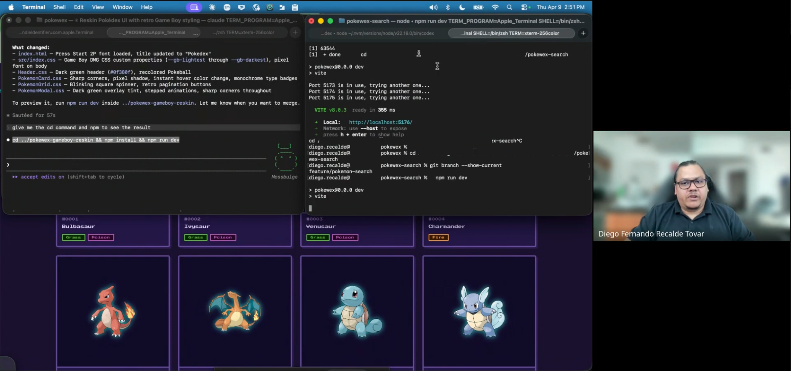
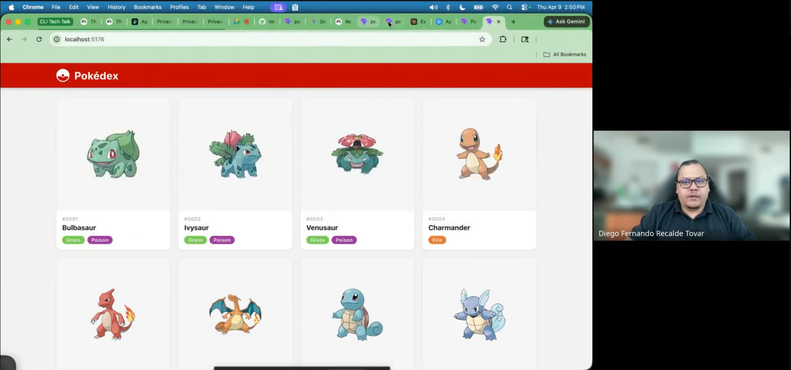
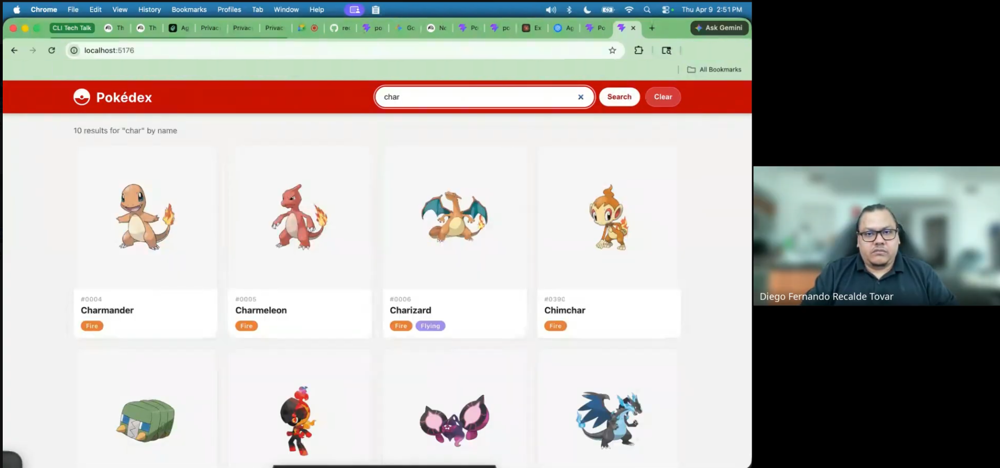
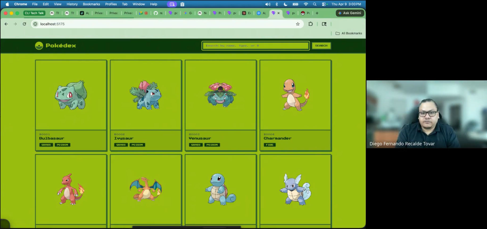

# Pokewex

Pokewex is a Pokédex-inspired web app built with React + Vite, consuming [PokeAPI v2](https://pokeapi.co/api/v2/).

This project was created as a practical demo for **Mastering the Agentic Terminal**, a talk about using AI CLIs such as Codex and Claude to move from step-by-step prompting toward agent orchestration.

The goal was to show how AI agents can help build and evolve a small product in an unfamiliar stack while the developer keeps direction, review, and final ownership. In the demo, parallel agent workflows were used so Codex could implement the search experience while Claude iterated on the visual style toward a retro Pokewex UI.

Slides: [Mastering the Agentic Terminal](docs/Mastering_The_Agentic_Terminal.pdf)

## Talk Demo Screenshots

These screenshots come from the tech talk demo and show the workflow moving from a baseline implementation to search functionality and a retro UI iteration.

| Parallel agent workflow | Baseline web UI |
|---|---|
|  |  |

| Search iteration | Retro UI iteration |
|---|---|
|  |  |

## Features

- Browse Pokémon with pagination (20 per page)
- Each card shows: image, number, name, and type badges with colors
- Click a Pokémon to open a detail modal with:
  - Official artwork, number, name, types
  - Height and weight
  - Flavor text description
  - Evolution chain
- Visual style inspired by the official Pokémon Pokédex concept
- Loading and error states

## Run locally

```bash
git clone https://github.com/recaldev/pokewex.git
cd pokewex
npm install
npm run dev
```

Then open http://localhost:5173

## Tech stack

- React 19 + Vite 8
- Plain CSS (no UI framework)
- PokeAPI v2 (no backend, no auth)

## AI workflow context

- Built as a demo project for an agentic CLI workflow talk.
- Used an unfamiliar stack intentionally to demonstrate assisted exploration and implementation.
- Split work across parallel Codex and Claude agent sessions.
- Kept human review and product direction as the final decision layer.
